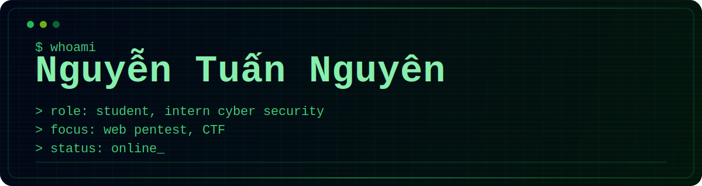

    

## Hi there 

I'm Nguyen, a 19 years old web penetration tester from Vietnam 

Currently studying at Academy of Cryptography Techniques

## 🌍💻 Technologies & Tools

  
  
  
  
  

  
  
  
  

